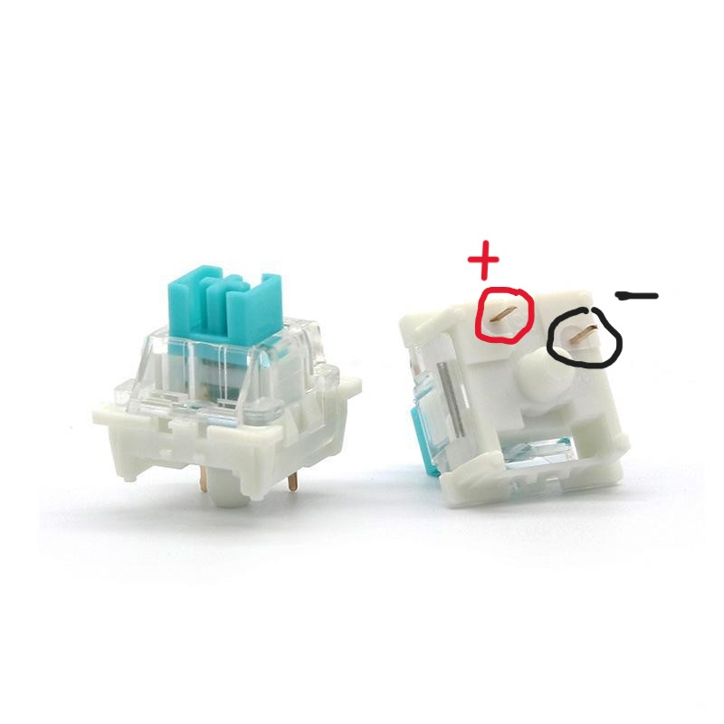
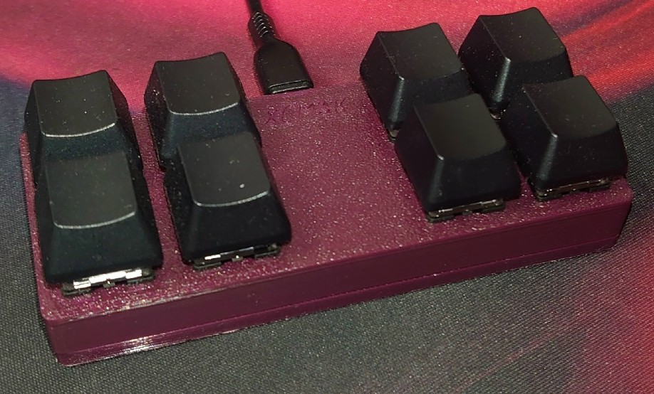
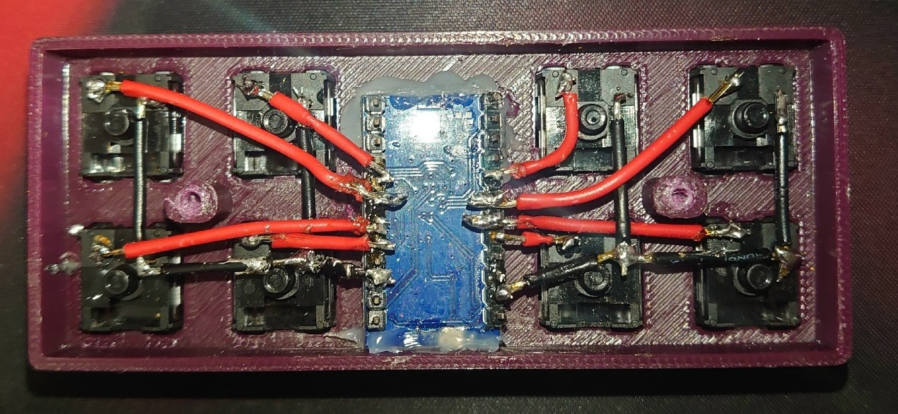

# Описание

Код для мини клавиатуры 8 кнопок + 3д модели для печати.\
Использованы:
- **Arduino Nano**
- **8 свичей**
- **Кейкапы**
- **Корпус**
- **Крышка**

# Сборка

## Подключение кнопок

\
Свич имеет два контакта (верхний и нижний)\
Верхний - + (к пину ардуино **каждый к своему**)\
Нижний - GND (к земле (**все к одному**))

Далее аккуратно поместить в корпус, припаять и готово.

# Параметры для настройки (под вашу плату)
## В начале программы (объявление)

`const int buttonPins[] = {....}` - Пины кнопок\
`const int numButtons = ...` - Количество кнопок\
`const int ledPin = 17` - Пин встроенного в Arduino Nano светодиода (у меня нет внешних светодиодов, использую 2 встроенных)

## Настройки кнопок

После `switch` указаны кнопки, пин и действие.

>**ПРИМЕЧАНИЕ:**\
В моём коде используются 2 режима - обычный и расширенный. Меняются они по нажатию кнопки 6 (**case 5**), поэтому у каждой кнопки может быть 2 действия. Нажатие кнопки 6 зажигает второй светодиод на плате.

Некоторые функции библиотеки `Keyboard.h`:

`Keyboard.print()` — вводит заданный текст.\
`Keyboard.println()` — вводит текст и переходит на новую строку.\
`Keyboard.press()` — нажимает указанную клавишу.\
`Keyboard.release()` — отпускает указанную клавишу.\
`Keyboard.releaseAll()` — отпускает все нажатые клавиши.\
`Keyboard.write()` — записывает данные через клавиатуру.

Для дополнительной информации смотрите документацию `Keyboard.h`
